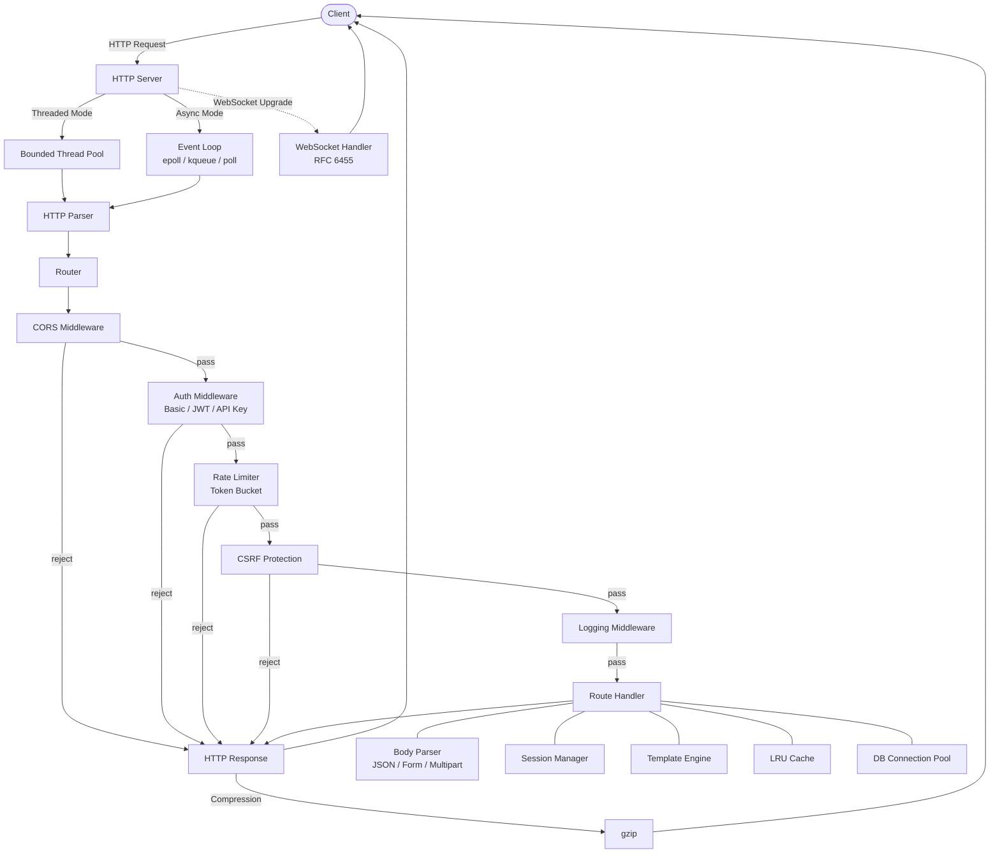

# Modern C Web Library


[](https://doi.org/10.5281/zenodo.18793559)
[](https://github.com/kamrankhan78694/modern-c-web-library/releases/latest)
[](https://opensource.org/licenses/MIT)

> **Version 2.0.1** — pure C web framework with zero external dependencies. The HTTP,
> WebSocket, and middleware stack is stable; the new pure-C TLS 1.3
> server that ships in 2.0.0 is **experimental and unaudited** — see
> [TLS 1.3 / HTTPS](#experimental-tls-13--https-off-by-default).

A modern AI-assisted C library for building efficient, scalable, and feature-rich web backends with support for routing, async I/O, middleware, and JSON handling.

**Repository:** https://github.com/kamrankhan78694/modern-c-web-library

## // Philosophy: Life, Code, Evolution

```
if(system.working) {
    // Classic wisdom
    printf("If it ain't broke, don't fix it…\n");
} else {
    // Evolution kicks in
    printf("Attempting adapt_fast()…\n");
    if(adapt_fast()) {
        printf("Adaptation succeeded. Survive(); Thrive();\n");
    } else {
        perish(); // The ultimate fallback
    }
}

// adapt_fast() attempts changes.  
// perish() triggers if adaptation fails.  
// Life, like code, only preserves what works—and tests what survives.

```

## Design Philosophy

This project is a **pure ISO C implementation** (C11 or later) designed to demonstrate that modern web functionality can be achieved entirely in standard C, without relying on external dependencies or third-party libraries.

**Core Principles:**
- **Pure ISO C**: All code is written in standard C (C11 or newer) for maximum portability
- **Zero External Dependencies**: No third-party libraries or frameworks are permitted
- **Self-Sufficient**: The library implements all required functionality from the ground up
- **Educational Foundation**: Serves as a reference implementation of modern C design patterns
- **Minimal & Transparent**: Every line of code is part of the project—no hidden dependencies

**Why Pure C?**
This approach ensures that developers can:
- Study and understand every aspect of the implementation
- Trust the codebase as a minimal, foundational reference
- Extend functionality without dependency conflicts
- Deploy on any platform with a C compiler
- Maintain full control over the entire codebase

Contributors should align with this philosophy. To maintain project integrity, suggestions involving external packages or higher-level language integrations cannot be accepted, as they conflict with the core mission of being a self-sufficient C library.

## Language Policy

The entire project is written in **standard ISO C** (C11 or newer). This is a strict policy to maintain the integrity of the project as a pure C foundation. C11 is the floor, not a ceiling — C17 and C23 toolchains build fine. The floor is C11 because the library uses `<stdatomic.h>` (connection-pool refcounting in `src/db_pool.c`) and `_Static_assert` (the header/CMake version consistency check).

**Language Requirements:**
- **C Only**: The library (`src/`, `include/`) and every test program (`tests/`) is written in C
- **No Foreign Languages in the shipped library**: every compiled source file under `src/`, `include/`, and `tests/` is C — the library and its test binaries contain no other language. Host-environment scaffolding sits outside this rule and is never linked into or required by the library: the Cloudflare Workers JS glue (`examples/worker.js`), the real-client interop harness (`tests/interop_openssl.sh`, registered as the `TlsInteropOpenssl` ctest suite), the Docker/publish helpers (`docker-run.sh`, `docker-verify.sh`, `publish-package.sh`), and three legacy ad-hoc WebSocket probes at the repo root (`test_basic_ws.py`, `test_handshake.py`, `test_ping.py`) that no build or CI step invokes
- **Standard C APIs**: Only standard C library functions and platform-specific system calls are permitted
- **No Code Generation**: All code must be written in C, not generated from other languages

**Why This Matters:**
- **Maximum Portability**: Standard C runs on virtually any platform with a C compiler
- **Transparency**: Every component is visible and understandable without learning multiple languages
- **Foundational Clarity**: Demonstrates that complex systems can be built entirely in C
- **Educational Value**: Provides a pure example of C craftsmanship and design
- **No Hidden Magic**: What you see is what you get—no abstraction layers or runtime dependencies

This policy emphasizes **C craftsmanship** over convenience through other ecosystems. The goal is to prove that modern web backends can be elegant, efficient, and maintainable using nothing but well-designed C code.

## Features

- **HTTP Server**: Multi-threaded and async I/O HTTP server
- **WebSocket Support**: Full RFC 6455 compliant WebSocket implementation with text/binary messages, ping/pong, and fragmentation support
- **Async I/O**: Full event loop support with epoll (Linux), kqueue (BSD/macOS), and poll fallback
- **Event Loop**: High-performance non-blocking I/O for handling thousands of concurrent connections
- **Routing**: Flexible routing with support for route parameters (e.g., `/users/:id`)
- **Middleware**: Chain middleware functions for request processing
- **JSON Support**: Built-in JSON parser and serializer with array support
- **Session Management**: Cookie-based server-side sessions with expiration and cleanup
- **Template Engine**: `{{ variable }}` syntax with context-based rendering and file loading
- **Authentication**: Basic Auth, API Key, and JWT (HMAC-SHA256) middleware — all in pure C
- **Database Connection Pool**: Thread-safe pooling with configurable min/max, validation, and stats
- **Body Parsing**: URL-encoded and multipart form data with file uploads
- **Cookie Handling**: RFC 6265 cookies with Secure, HttpOnly, SameSite support
- **CORS Middleware**: Configurable cross-origin resource sharing
- **Rate Limiting**: IP-based rate limiting with token bucket algorithm
- **Static File Serving**: MIME detection, ETag, path traversal prevention
- **Thread Pool**: Bounded thread pool with configurable worker count
- **Graceful Shutdown**: Server state machine with drain timeout
- **Socket Timeouts**: Configurable read/write timeouts to prevent slow-loris attacks
- **CSRF Protection**: Double-submit cookie pattern with constant-time comparison
- **Input Validation**: Length, charset, integer, email validation and HTML sanitization
- **Logging Middleware**: Configurable log levels with timestamp formatting
- **Error Handler**: Centralized JSON error responses for 4xx/5xx status codes
- **Health Check**: Built-in `/healthz` endpoint with JSON status
- **In-Memory Cache**: LRU eviction, TTL support, thread-safe implementation
- **Metrics Middleware**: Request counting, per-method tracking, JSON `/metrics` endpoint
- **Response Compression**: Pure C gzip (RFC 1952) with Accept-Encoding negotiation
- **Async WebSocket**: Event loop integration with non-blocking I/O and write queue
- **Benchmarking Suite**: Throughput/latency measurement with percentile statistics
- **Security Headers**: HSTS, CSP, X-Frame-Options and friends as a middleware
- **Environment Config**: Configuration from environment variables with typed accessors (string, int, bool, port) and defaults
- **WASM & Cloudflare Workers**: Emscripten build target plus a Workers runtime with KV, R2, D1, and Queues binding APIs — the bindings are **in-memory simulations in every build (native, test, and WASM)**, not the real Cloudflare services. No JS glue ships that would reach the real bindings: `examples/worker.js` never passes `env` into WASM, and no `wrangler.toml` ships
- **TLS 1.3 (experimental)**: Hand-written, zero-dependency pure-C TLS 1.3 server termination via `http_server_enable_tls()` — `TLS_CHACHA20_POLY1305_SHA256` + X25519 + Ed25519 only, server-side, threaded mode only. Off by default — build with `-DWEBLIB_ENABLE_TLS=ON`. Native-only (not WASM/Workers). Interoperates with `openssl s_client`; browsers are **not** supported (Ed25519-only certificates). **UNAUDITED — not for production use without an external cryptographic audit.** See [`src/tls/README.md`](src/tls/README.md) and [`examples/tls_server.c`](examples/tls_server.c).
- **Cross-Platform**: Linux and macOS, both built and tested in CI on every push. **Windows is not supported** — the networking core (`src/http_server.c`, `src/websocket.c`) includes POSIX socket headers unconditionally and closes sockets with `close()` rather than `closesocket()`. An MSVC build and a Windows CI job are planned as Phase 17
- **Modern C Patterns**: Clean, modular API design with zero external dependencies

## Architecture



## Quick Start

### Option 1: Using Docker (Recommended for Contributors)

Docker provides a consistent build environment without installing dependencies:

```bash
# Clone the repository
git clone https://github.com/kamrankhan78694/modern-c-web-library.git
cd modern-c-web-library

# Build and run tests
./docker-run.sh test

# Start development environment
./docker-run.sh dev

# Run the server
./docker-run.sh async
```

See [DOCKER.md](DOCKER.md) for complete Docker documentation.

### Option 2: Building Locally

#### Building the Library

```bash
# Create build directory
mkdir build && cd build

# Configure with CMake
cmake ..

# Build
make

# Run tests
make test
```

#### Running the Example Server

```bash
# From build directory
./examples/simple_server

# Or specify a custom port
./examples/simple_server 3000
```

The example server will start on port 8080 (or your specified port) with the following endpoints:

- `GET /` - Welcome message
- `GET /hello` - Hello World
- `GET /api/json` - JSON response example
- `GET /users/:id` - User info with route parameters
- `POST /api/data` - Echo posted data

## Public Header Name

The public API header is now `kamran.k` only. Repository examples typically use quotes, while installed-header usage may prefer angle brackets:

```c
#include "kamran.k"
/* or: #include <kamran.k> */
```

Use `kamran.k` for all public API includes.

## Docker Development Environment

For contributors who want a consistent, reproducible environment without installing dependencies locally, we provide a Docker setup.

### Quick Start with Docker

```bash
# Build the Docker image
docker build -t modern-c-web-library .

# Run the container (starts the async HTTP server on port 8080)
docker run --rm -p 8080:8080 modern-c-web-library
```

### Development with Docker Compose

For active development with live code editing:

```bash
# Start the development container
docker-compose run --rm weblib-dev
```

**First-time setup inside the container (when /workspace/build is empty):**

```bash
mkdir -p build && cd build
cmake ..
make
make test
```

**For subsequent rebuilds after code changes:**

```bash
cd build
make
make test
```

The `docker-compose.yml` configuration mounts your source code, so you can edit files locally and rebuild inside the container.

### What's Included in the Docker Environment

- **Debian-based images**: `gcc:11` builder, with a `debian:bullseye-slim` runtime stage for the production image
- **Build tools**: gcc, g++, make, cmake, git
- **Pre-built library**: The image compiles the library, examples, and test binaries during image creation — the tests are *not* executed at build time
- **Verification script**: `./docker-verify.sh` is run manually from the host. It builds the dev and production images and runs the `test_weblib` binary (the `WebLibTests` suite) inside the container — not the full ctest run

### Docker Commands Reference

```bash
# Build the image
docker build -t modern-c-web-library .

# Run the test suite (builds and runs Dockerfile.dev)
./docker-run.sh test

# Start interactive shell
docker run --rm -it modern-c-web-library /bin/bash

# Run example server (requires port mapping)
docker run --rm -p 8080:8080 modern-c-web-library /app/simple_server 8080

# Use docker-compose for development
docker-compose run --rm weblib-dev /bin/bash
```

### Benefits of Docker for Contributors

- **No local dependencies**: No need to install gcc, cmake, or other tools
- **Consistent environment**: Same build environment for all contributors
- **Isolated testing**: Test changes without affecting your system
- **CI/CD ready**: Same environment can be used in continuous integration

## Usage

### Basic HTTP Server

```c
#include "kamran.k"

void handle_root(http_request_t *req, http_response_t *res) {
    http_response_send_text(res, HTTP_OK, "Hello, World!");
}

int main(void) {
    // Create server and router
    http_server_t *server = http_server_create();
    router_t *router = router_create();
    
    // Add routes
    router_add_route(router, HTTP_GET, "/", handle_root);
    
    // Set router and start server
    http_server_set_router(server, router);
    http_server_listen(server, 8080);
    
    // Cleanup
    router_destroy(router);
    http_server_destroy(server);
    
    return 0;
}
```

### Route Parameters

```c
void handle_user(http_request_t *req, http_response_t *res) {
    const char *user_id = http_request_get_param(req, "id");
    // ... handle user request
}

router_add_route(router, HTTP_GET, "/users/:id", handle_user);
```

### JSON Handling

```c
void handle_api(http_request_t *req, http_response_t *res) {
    // Create JSON object
    json_value_t *json = json_object_create();
    json_object_set(json, "message", json_string_create("Success"));
    json_object_set(json, "status", json_number_create(200));
    
    // Send JSON response
    http_response_send_json(res, HTTP_OK, json);
    json_value_free(json);
}
```

### Middleware

```c
bool logging_middleware(http_request_t *req, http_response_t *res, void *user_data) {
    (void)res;
    (void)user_data;
    printf("Request: %s\n", req->path);
    return true; // Continue to next middleware/handler
}

router_use_middleware(router, logging_middleware);
```

### Async I/O Mode

The library supports full async I/O with event loops for high-performance, non-blocking request handling:

```c
#include "kamran.k"

int main(void) {
    // Create server
    http_server_t *server = http_server_create();
    
    // Enable async I/O mode
    http_server_set_async(server, true);
    
    // Get event loop (for advanced use cases)
    event_loop_t *loop = http_server_get_event_loop(server);
    
    // Create and set up router
    router_t *router = router_create();
    router_add_route(router, HTTP_GET, "/", handle_root);
    http_server_set_router(server, router);
    
    // Start server (runs event loop internally)
    http_server_listen(server, 8080);
    
    // Cleanup
    router_destroy(router);
    http_server_destroy(server);
    
    return 0;
}
```

**Event Loop Backends:**
- **Linux**: epoll (high performance)
- **macOS/BSD**: kqueue (high performance)
- **Fallback**: poll (portable)

### Event Loop API

For advanced use cases, you can use the event loop directly:

```c
// Create event loop
event_loop_t *loop = event_loop_create();

// Add file descriptor to monitor
event_loop_add_fd(loop, fd, EVENT_READ | EVENT_WRITE, callback, user_data);

// Modify events for a file descriptor
event_loop_modify_fd(loop, fd, EVENT_READ);

// Remove file descriptor
event_loop_remove_fd(loop, fd);

// Add timeout
int timer_id = event_loop_add_timeout(loop, 1000, timeout_callback, user_data);

// Cancel timeout
event_loop_cancel_timeout(loop, timer_id);

// Run event loop
event_loop_run(loop);

// Stop event loop (from signal handler or callback)
event_loop_stop(loop);

// Cleanup
event_loop_destroy(loop);
```

### WebSocket Support

The library includes full WebSocket support compliant with RFC 6455:

```c
#include "kamran.k"

/* WebSocket message callback */
void on_message(websocket_connection_t *conn, ws_message_type_t type, 
                const void *data, size_t len) {
    if (type == WS_MESSAGE_TEXT) {
        printf("Received: %.*s\n", (int)len, (const char *)data);
        /* Echo back */
        websocket_send_text(conn, (const char *)data);
    } else {
        printf("Received binary: %zu bytes\n", len);
        websocket_send_binary(conn, data, len);
    }
}

/* WebSocket close callback */
void on_close(websocket_connection_t *conn, uint16_t code) {
    printf("Connection closed with code %u\n", code);
}

/* HTTP route handler for WebSocket upgrade */
void handle_websocket(http_request_t *req, http_response_t *res) {
    /* Perform WebSocket handshake */
    if (!websocket_handle_upgrade(req, res)) {
        return; /* Handshake failed */
    }
    
    /* Create WebSocket connection 
     * Note: In production, you would extract the socket fd from the
     * HTTP connection and integrate with the event loop for async I/O
     */
}

/* In your main function */
router_add_route(router, HTTP_GET, "/ws", handle_websocket);
```

**WebSocket Features:**
- **Protocol Compliance**: Full RFC 6455 implementation
- **Message Types**: Text and binary messages
- **Fragmentation**: Automatic handling of fragmented messages
- **Control Frames**: Ping, pong, and close frames with automatic pong responses
- **Security**: Proper masking/unmasking of frames
- **Connection Management**: Open, close, and error callbacks
- **Frame Processing**: Complete implementation in threaded mode
  - Persistent connections after HTTP upgrade
  - Automatic ping/pong handling
  - Multiple concurrent WebSocket connections
  - Covered by the `AsyncWebSocketTests` suite and the WebSocket cases in `WebLibTests`

**Status:** Both threaded mode and async mode (event loop integration) are complete and covered
by the test suite. WebSocket over TLS (`wss://`) is **not** supported — a WebSocket upgrade on a
TLS-terminated connection is refused with 503.

See `examples/websocket_echo_server.c` for a complete WebSocket server implementation with a browser-based test client.

## API Reference

### HTTP Server

- `http_server_t *http_server_create(void)` - Create a new HTTP server
- `int http_server_listen(http_server_t *server, uint16_t port)` - Start listening on port
- `void http_server_stop(http_server_t *server)` - Stop the server
- `void http_server_destroy(http_server_t *server)` - Destroy server and free resources
- `int http_server_set_async(http_server_t *server, bool enable)` - Enable/disable async I/O mode
- `event_loop_t *http_server_get_event_loop(http_server_t *server)` - Get server's event loop
- `int http_server_enable_tls(http_server_t *server, const char *cert_pem, size_t cert_len, const char *key_pem, size_t key_len)` - Terminate TLS 1.3 on this server. Takes PEM **buffers with lengths**, not file paths. Call before `http_server_listen()`; returns `-1` in async mode. Requires `-DWEBLIB_ENABLE_TLS=ON`. **Experimental and unaudited** — see [Experimental TLS 1.3 / HTTPS](#experimental-tls-13--https-off-by-default)

### Router

- `router_t *router_create(void)` - Create a new router
- `int router_add_route(router_t *router, http_method_t method, const char *path, route_handler_t handler)` - Add a route
- `int router_use_middleware(router_t *router, middleware_fn_t middleware)` - Add middleware
- `void router_destroy(router_t *router)` - Destroy router

### Event Loop

- `event_loop_t *event_loop_create(void)` - Create a new event loop
- `int event_loop_add_fd(event_loop_t *loop, int fd, int events, event_callback_t callback, void *user_data)` - Monitor file descriptor
- `int event_loop_modify_fd(event_loop_t *loop, int fd, int events)` - Modify events for file descriptor
- `int event_loop_remove_fd(event_loop_t *loop, int fd)` - Stop monitoring file descriptor
- `int event_loop_run(event_loop_t *loop)` - Run the event loop
- `void event_loop_stop(event_loop_t *loop)` - Stop the event loop
- `int event_loop_add_timeout(event_loop_t *loop, int timeout_ms, event_callback_t callback, void *user_data)` - Add timeout
- `int event_loop_cancel_timeout(event_loop_t *loop, int timer_id)` - Cancel timeout
- `void event_loop_destroy(event_loop_t *loop)` - Destroy event loop

### WebSocket

- `bool websocket_handle_upgrade(http_request_t *req, http_response_t *res)` - Handle WebSocket upgrade handshake
- `websocket_connection_t *websocket_connection_create(int fd)` - Create WebSocket connection from fd
- `void websocket_connection_destroy(websocket_connection_t *conn)` - Destroy WebSocket connection
- `int websocket_send(websocket_connection_t *conn, ws_message_type_t type, const void *data, size_t len)` - Send WebSocket message
- `int websocket_send_text(websocket_connection_t *conn, const char *text)` - Send text message
- `int websocket_send_binary(websocket_connection_t *conn, const void *data, size_t len)` - Send binary message
- `int websocket_send_ping(websocket_connection_t *conn, const void *data, size_t len)` - Send ping frame
- `int websocket_send_pong(websocket_connection_t *conn, const void *data, size_t len)` - Send pong frame
- `int websocket_close(websocket_connection_t *conn, uint16_t code, const char *reason)` - Close connection gracefully
- `int websocket_process_data(websocket_connection_t *conn, const uint8_t *data, size_t len)` - Process incoming data
- `void websocket_set_message_callback(websocket_connection_t *conn, websocket_message_cb_t callback)` - Set message callback
- `void websocket_set_close_callback(websocket_connection_t *conn, websocket_close_cb_t callback)` - Set close callback
- `void websocket_set_error_callback(websocket_connection_t *conn, websocket_error_cb_t callback)` - Set error callback
- `bool websocket_is_open(websocket_connection_t *conn)` - Check if connection is open

### JSON

- `json_value_t *json_parse(const char *json_str)` - Parse JSON string
- `json_value_t *json_object_create(void)` - Create JSON object
- `void json_object_set(json_value_t *obj, const char *key, json_value_t *value)` - Set object property
- `json_value_t *json_object_get(json_value_t *obj, const char *key)` - Get object property
- `char *json_stringify(json_value_t *value)` - Convert JSON to string
- `void json_value_free(json_value_t *value)` - Free JSON value

## Project Structure

```
modern-c-web-library/
├── include/
│   ├── kamran.k           # Public API header
│   └── db_pool.h          # Database connection pool header
├── src/
│   ├── http_server.c      # HTTP server implementation (sync & async)
│   ├── router.c           # Router implementation
│   ├── json.c             # JSON parser/serializer
│   ├── event_loop.c       # Event loop (epoll/kqueue/poll)
│   ├── websocket.c        # WebSocket protocol (RFC 6455)
│   ├── async_websocket.c  # Async WebSocket with event loop
│   ├── body_parser.c      # Request body parsing
│   ├── cookie.c           # Cookie handling (RFC 6265)
│   ├── session.c          # Session management
│   ├── template.c         # Template engine
│   ├── cache.c            # In-memory LRU cache
│   ├── compression.c      # Response compression (gzip)
│   ├── benchmark.c        # Benchmarking suite
│   ├── thread_pool.c      # Bounded thread pool
│   ├── db_pool.c          # Database connection pool
│   ├── health_check.c     # Health check endpoint
│   ├── input_validation.c # Input validation helpers
│   ├── middleware_auth.c   # Authentication (Basic/JWT/API-Key)
│   ├── middleware_cors.c   # CORS middleware
│   ├── middleware_csrf.c   # CSRF protection
│   ├── middleware_error.c  # Error handler middleware
│   ├── middleware_log.c    # Logging middleware
│   ├── middleware_metrics.c# Metrics middleware
│   ├── middleware_ratelimit.c # Rate limiting
│   ├── middleware_static.c # Static file serving
│   ├── middleware_security_headers.c # Security response headers
│   ├── env_config.c       # Environment/config loading
│   ├── security_utils.c   # Constant-time compare, secure zeroing
│   ├── wasm_runtime.c     # WASM runtime bindings
│   ├── worker_runtime.c   # Cloudflare Workers fetch-event bridge
│   ├── worker_kv.c        # Workers KV binding emulation
│   ├── worker_r2.c        # Workers R2 binding emulation
│   ├── worker_d1.c        # Workers D1 binding emulation
│   ├── worker_queues.c    # Workers Queues binding emulation
│   ├── crypto/            # SHA-256, Base64
│   └── tls/               # Experimental pure-C TLS 1.3 server (native-only,
│                          #   UNAUDITED, OFF by default: -DWEBLIB_ENABLE_TLS=ON)
├── examples/
│   ├── simple_server.c    # Basic HTTP server (threaded)
│   ├── async_server.c     # Async HTTP server (event loop)
│   ├── rest_api_server.c  # Full CRUD REST API example
│   ├── websocket_echo_server.c        # WebSocket echo server
│   ├── async_websocket_echo_server.c  # Async WebSocket server
│   ├── tls_server.c       # HTTPS example (experimental TLS; -DWEBLIB_ENABLE_TLS=ON)
│   ├── worker_example.c   # Cloudflare Workers example (native-testable)
│   ├── worker.js          # Cloudflare Workers JavaScript glue
│   └── wasm_example.c     # WebAssembly demo
├── tests/
│   ├── test_weblib.c      # Core unit tests (166 tests)
│   ├── test_kamran_header.c, test_async_websocket.c, test_stress.c
│   ├── test_worker.c, test_wasm.c
│   ├── test_tls*.c        # 6 TLS suites (need -DWEBLIB_ENABLE_TLS=ON;
│   │                      #   test_tls_http.c also needs -DWEBLIB_TLS_TEST_HOOKS=ON)
│   └── interop_openssl.sh # Real `openssl s_client` interop test
├── docs/
│   ├── api/README.md      # Complete API reference
│   ├── tutorials/         # Step-by-step tutorials
│   ├── DEBUGGING.md       # Debugging guide
│   ├── DEPLOYMENT.md      # Production deployment guide
│   └── TECHNICAL_DEBT.md  # Known trade-offs
├── CMakeLists.txt         # Main CMake configuration
├── README.md              # This file
├── CHANGELOG.md           # Version history
├── TODO.md                # Feature roadmap
├── NEXT_PHASE.md          # Detailed phase roadmap
├── LICENSE                # MIT License
└── .gitignore             # Git ignore rules
```

## Building on Different Platforms

### Using Docker (All Platforms)

Docker provides the easiest way to build and test on any platform:

```bash
# Build and test
./docker-run.sh test

# Development environment
./docker-run.sh dev

# Run server
./docker-run.sh async
```

See [DOCKER.md](DOCKER.md) for detailed Docker usage.

### Native Builds

#### Linux/macOS

```bash
mkdir build && cd build
cmake ..
make
```

#### Windows (Visual Studio)

```bash
mkdir build && cd build
cmake .. -G "Visual Studio 16 2019"
cmake --build .
```

#### Windows (MinGW)

```bash
mkdir build && cd build
cmake .. -G "MinGW Makefiles"
mingw32-make
```

#### Experimental TLS 1.3 / HTTPS (off by default)

`WEBLIB_ENABLE_TLS` is **OFF** by default. With it off, none of `src/tls/` is compiled and the
build is byte-identical to a build from before TLS existed. TLS is **native-only** — it is not
available in WASM or Cloudflare Workers builds.

```bash
cmake -S . -B build-tls -DCMAKE_BUILD_TYPE=RelWithDebInfo -DWEBLIB_ENABLE_TLS=ON
cmake --build build-tls --parallel
cd build-tls && ctest --output-on-failure   # 12 suites, incl. 6 TLS suites
```

To also run the end-to-end HTTPS test, add the test-only RNG hook:

```bash
cmake -S . -B build-tls -DCMAKE_BUILD_TYPE=RelWithDebInfo \
      -DWEBLIB_ENABLE_TLS=ON -DWEBLIB_TLS_TEST_HOOKS=ON
cmake --build build-tls --parallel
cd build-tls && ctest --output-on-failure   # 14 suites, incl. 7 TLS suites
```

> `WEBLIB_TLS_TEST_HOOKS` exposes a deterministic RNG so handshakes are reproducible in tests.
> It is **TEST-ONLY** — never enable it in a production or distributed build.

Running the HTTPS example needs a self-signed Ed25519 certificate. From the repo root:

```bash
openssl genpkey -algorithm ed25519 -out key.pem
openssl req -x509 -new -key key.pem -out cert.pem -days 365 -subj "/CN=localhost"
./build-tls/examples/tls_server cert.pem key.pem 8443

# In another shell — the same client `tests/interop_openssl.sh` drives in CI.
# Pipe the request in, otherwise s_client just sits at an interactive prompt:
printf 'GET /hello HTTP/1.1\r\nHost: localhost\r\nConnection: close\r\n\r\n' \
    | openssl s_client -quiet -connect 127.0.0.1:8443 -tls1_3
```

To enable TLS on your own server, read the PEM files yourself and hand the library the
buffers — `http_server_enable_tls()` takes PEM **contents plus lengths**, not file paths:

```c
/* Must be called before http_server_listen(). Returns -1 if the build has no TLS,
 * if the PEM is unusable, or if async mode is enabled on this server. */
if (http_server_enable_tls(server, cert_pem, cert_len, key_pem, key_len) != 0) {
    fprintf(stderr, "TLS could not be enabled\n");
    return 1;
}
```

> **EXPERIMENTAL / UNAUDITED.** One profile only: `TLS_CHACHA20_POLY1305_SHA256` + X25519 +
> Ed25519 — no AES-GCM, no RSA/ECDSA, no TLS 1.2. Server-side only, threaded mode only
> (`http_server_enable_tls()` returns `-1` if async mode is enabled), and WebSocket upgrades
> over a TLS connection are refused with 503. It interoperates with `openssl s_client`;
> browser page-load is **not** supported, because Ed25519-only certificates have limited and
> inconsistent browser support. Do not use it in production without an external cryptographic
> audit. Full details: [`src/tls/README.md`](src/tls/README.md).

### WebAssembly (Emscripten)

The library supports compilation to WebAssembly using [Emscripten](https://emscripten.org/).
WASM-safe components (JSON, router, template engine, input validation, cookies, body
parser, compression) are fully functional in browser and WASM runtime environments.

#### Prerequisites

Install the Emscripten SDK:

```bash
git clone https://github.com/emscripten-core/emsdk.git
cd emsdk && ./emsdk install latest && ./emsdk activate latest
source ./emsdk_env.sh
```

#### Building for WASM

```bash
mkdir build-wasm && cd build-wasm
emcmake cmake ..
emmake make
```

This produces a static library (`libweblib.a`) compiled to WASM. Link it into
your Emscripten project:

```bash
emcc -o app.js your_app.c -I../include -L. -lweblib \
     -sEXPORTED_RUNTIME_METHODS=ccall,cwrap -sWASM=1
```

#### WASM-Safe API

All WASM-exported functions use the `wasm_` prefix:

```c
#include "kamran.k"

// Query capabilities
const char *ver  = wasm_weblib_version();
bool has_json    = wasm_weblib_has_capability("json");

// JSON (parse, build, stringify)
json_value_t *obj = wasm_json_parse("{\"key\":\"value\"}");
char *str = wasm_json_stringify(obj);
wasm_free(str);
wasm_json_free(obj);

// Router
router_t *r = wasm_router_create();
wasm_router_add_route(r, HTTP_GET, "/api", handler);
wasm_router_destroy(r);

// Input validation
wasm_validate_email("user@example.com");   // true
int n; wasm_validate_integer("42", &n);    // true, n=42

// Template rendering
template_context_t *ctx = wasm_template_context_create();
wasm_template_context_set(ctx, "name", "World");
char *out = wasm_template_render("Hello {{name}}!", ctx);
wasm_free(out);
wasm_template_context_destroy(ctx);
```

See `examples/wasm_example.c` for a complete demonstration.

### Cloudflare Workers

The library provides first-class support for running inside
[Cloudflare Workers](https://developers.cloudflare.com/workers/) via WASM.
The Worker runtime layer (`worker_*` API) bridges the Workers fetch-event
model to the library's request/response helpers, and provides in-memory
simulations of Cloudflare's infrastructure bindings (KV, R2, D1, Queues) —
in **every** build, native and WASM alike, not just locally. Note that
`worker_set_router()` is accepted but **not used for dispatch**; see the
note under Quick Start.

#### Worker API Overview

| Function | Purpose |
|----------|---------|
| `worker_request_create(method, url)` | Create a request from fetch event data |
| `worker_request_set_header/body()` | Populate request headers and body |
| `worker_handle_fetch(req, env)` | Dispatch to the handler registered with `worker_set_fetch_handler()`. **Routers are not dispatched**: with only `worker_set_router()` set it returns a 200 placeholder without matching any route; with neither, 503 |
| `worker_response_get_status/body/header()` | Read response fields |
| `worker_response_set_body_text/set_json()` | Convenience response builders |
| `worker_env_create/add_binding()` | Environment with named service bindings |

#### Cloudflare Infrastructure Bindings

| Binding | C Type | Cloudflare API | Functions |
|---------|--------|----------------|-----------|
| **KV** | `worker_kv_t` | `env.KV.get/put/delete/list` | `worker_kv_create/put/get/delete/list/destroy` |
| **R2** | `worker_r2_bucket_t` | `env.BUCKET.get/put/delete/list/head` | `worker_r2_bucket_create/put/get/delete/list/head/destroy` |
| **D1** | `worker_d1_t` | `env.DB.prepare().bind().run/all/first` | `worker_d1_create/prepare/exec/batch/destroy` |
| **Queues** | `worker_queue_t` | `env.QUEUE.send/sendBatch` | `worker_queue_create/send/send_batch/consume/destroy` |
| **env** | `worker_env_t` | `fetch(request, env, ctx)` | `worker_env_create/add_binding/get_binding/destroy` |

#### Quick Start

> **Note:** `worker_set_router()` is accepted but **not used for dispatch**. The
> native and WASM builds share one `worker_handle_fetch()` implementation that does
> not inspect the URL path, so a router-only Worker answers *every* request —
> including `/api/hello` below — with a 200 placeholder. To route, register a
> handler with `worker_set_fetch_handler()` and branch on
> `worker_request_get_url(req)` inside it. The router call below is shown because
> it is the current API shape, not because it dispatches.

**1. Write your Worker in C:**

```c
#include "kamran.k"

static router_t *g_router = NULL;

static void handle_hello(http_request_t *req, http_response_t *res) {
    (void)req;
    json_value_t *json = json_object_create();
    json_object_set(json, "message", json_string_create("Hello from Worker!"));
    http_response_send_json(res, HTTP_OK, json);
    json_value_free(json);
}

/* Called once on Worker startup */
WASM_EXPORT void worker_init(void) {
    g_router = router_create();
    router_add_route(g_router, HTTP_GET, "/api/hello", handle_hello);
    worker_set_router(g_router);
}

/* Called for every fetch event */
WASM_EXPORT worker_response_t *worker_fetch(const char *method, const char *url) {
    worker_request_t *req = worker_request_create(method, url);
    worker_response_t *res = worker_handle_fetch(req, NULL);
    worker_request_destroy(req);
    return res;
}

WASM_EXPORT void worker_cleanup(void) {
    router_destroy(g_router);
}
```

**2. Compile to WASM with Emscripten:**

```bash
mkdir build-wasm && cd build-wasm
emcmake cmake ..
emmake make

emcc -o worker.wasm.js your_worker.c -I../include -L. -lweblib \
     -sEXPORTED_RUNTIME_METHODS=ccall,cwrap,allocateUTF8,UTF8ToString \
     -sEXPORTED_FUNCTIONS=_worker_init,_worker_fetch,_worker_cleanup,_worker_response_get_status,_worker_response_get_body,_worker_response_destroy,_malloc,_free \
     -sWASM=1 -sMODULARIZE=1 -sEXPORT_NAME=createModule
```

**3. Wire up the JavaScript glue** (see `examples/worker.js`):

```js
import createModule from "./worker.wasm.js";
let wasm = null;

async function ensureInit() {
    if (wasm) return;
    wasm = await createModule();
    wasm._worker_init();
}

export default {
    async fetch(request, env, ctx) {
        await ensureInit();
        const url = new URL(request.url);
        const methodPtr = wasm.allocateUTF8(request.method);
        const pathPtr   = wasm.allocateUTF8(url.pathname + url.search);

        const resPtr = wasm._worker_fetch(methodPtr, pathPtr);
        wasm._free(methodPtr);
        wasm._free(pathPtr);

        const status = wasm._worker_response_get_status(resPtr);
        const bodyPtr = wasm._worker_response_get_body(resPtr);
        const body = bodyPtr ? wasm.UTF8ToString(bodyPtr) : "";
        wasm._worker_response_destroy(resPtr);
        return new Response(body, { status });
    },
};
```

#### Worker KV Store

Models [Cloudflare Workers KV](https://developers.cloudflare.com/kv/) with
TTL support, metadata, and cursor-based listing:

```c
worker_kv_t *kv = worker_kv_create("MY_KV");

/* Put with optional TTL */
worker_kv_put_options_t opts = { .expiration_ttl = 3600 };
worker_kv_put(kv, "session", "abc123", &opts);

/* Get (returns owned string — caller must free) */
char *val = worker_kv_get(kv, "session");
printf("session = %s\n", val);
free(val);

/* List keys with prefix */
worker_kv_list_options_t list_opts = { .prefix = "session:", .limit = 100 };
worker_kv_list_result_t *result = worker_kv_list(kv, &list_opts);
for (int i = 0; i < result->count; i++) {
    printf("  key: %s\n", result->keys[i]);
}
worker_kv_list_result_destroy(result);

worker_kv_delete(kv, "session");
worker_kv_destroy(kv);
```

#### Worker R2 Object Storage

Models [Cloudflare R2](https://developers.cloudflare.com/r2/) with
put, get, head, delete, and list:

```c
worker_r2_bucket_t *bucket = worker_r2_bucket_create("MY_BUCKET");

/* Store an object */
worker_r2_put_options_t opts = { .content_type = "image/png" };
worker_r2_put(bucket, "images/logo.png", data, size, &opts);

/* Retrieve an object */
worker_r2_object_t *obj = worker_r2_get(bucket, "images/logo.png");
if (obj) {
    printf("size=%zu type=%s\n", obj->size, obj->content_type);
    worker_r2_object_destroy(obj);
}

/* Head (metadata only, no body) */
worker_r2_object_t *meta = worker_r2_head(bucket, "images/logo.png");
printf("etag=%s\n", meta->etag);
worker_r2_object_destroy(meta);

worker_r2_delete(bucket, "images/logo.png");
worker_r2_bucket_destroy(bucket);
```

#### Worker D1 Database

Models [Cloudflare D1](https://developers.cloudflare.com/d1/) with
prepared statements, parameter binding, and batch execution:

```c
worker_d1_t *db = worker_d1_create("MY_DB");

/* DDL via exec */
worker_d1_result_t *r = worker_d1_exec(db, "CREATE TABLE users (id TEXT, name TEXT)");
worker_d1_result_destroy(r);

/* Prepared statement with binding */
worker_d1_stmt_t *stmt = worker_d1_prepare(db, "INSERT INTO users VALUES (?, ?)");
worker_d1_stmt_bind(stmt, 1, "1");
worker_d1_stmt_bind(stmt, 2, "Alice");
worker_d1_result_t *res = worker_d1_stmt_run(stmt);
worker_d1_result_destroy(res);
worker_d1_stmt_destroy(stmt);

/* Query all rows */
worker_d1_stmt_t *q = worker_d1_prepare(db, "SELECT * FROM users");
json_value_t *rows = worker_d1_stmt_all(q);
char *json_str = json_stringify(rows);
printf("rows: %s\n", json_str);
free(json_str);
json_value_free(rows);
worker_d1_stmt_destroy(q);

worker_d1_destroy(db);
```

#### Worker Queues

Models [Cloudflare Queues](https://developers.cloudflare.com/queues/)
with send, batch send, and consume:

```c
worker_queue_t *q = worker_queue_create("MY_QUEUE");

/* Send a single message */
worker_queue_send(q, "{\"type\":\"email\"}", 16);
worker_queue_send_text(q, "plain text message");

/* Send JSON */
json_value_t *json = json_object_create();
json_object_set(json, "task", json_string_create("notify"));
worker_queue_send_json(q, json);
json_value_free(json);

/* Send a batch */
const char *bodies[] = { "msg1", "msg2", "msg3" };
size_t lengths[] = { 4, 4, 4 };
worker_queue_send_batch(q, bodies, lengths, 3);

/* Consume messages */
worker_queue_batch_t *batch = worker_queue_consume(q, 10, 0);
for (int i = 0; i < batch->count; i++) {
    printf("msg: %s\n", batch->messages[i]->body);
    worker_queue_message_ack(batch->messages[i]);
}
worker_queue_batch_destroy(batch);

worker_queue_destroy(q);
```

#### Worker Environment Context

The `worker_env_t` models Cloudflare's `env` object with named bindings
for KV, R2, D1, and Queues — matching the `wrangler.toml` binding pattern:

```c
/* Create resources */
worker_kv_t *kv = worker_kv_create("CACHE");
worker_r2_bucket_t *r2 = worker_r2_bucket_create("ASSETS");
worker_d1_t *db = worker_d1_create("DB");
worker_queue_t *q = worker_queue_create("JOBS");

/* Create env and bind (matches wrangler.toml binding names) */
worker_env_t *env = worker_env_create();
worker_env_add_binding(env, "CACHE", WORKER_BINDING_KV, kv);
worker_env_add_binding(env, "ASSETS", WORKER_BINDING_R2, r2);
worker_env_add_binding(env, "DB", WORKER_BINDING_D1, db);
worker_env_add_binding(env, "JOBS", WORKER_BINDING_QUEUE, q);

/* Access bindings by name and type */
worker_kv_t *cache = worker_env_get_binding(env, "CACHE", WORKER_BINDING_KV);
worker_d1_t *database = worker_env_get_binding(env, "DB", WORKER_BINDING_D1);

/* Cleanup */
worker_env_destroy(env);   /* does NOT free bound resources */
worker_kv_destroy(kv);
worker_r2_bucket_destroy(r2);
worker_d1_destroy(db);
worker_queue_destroy(q);
```

See `examples/worker_example.c` for a complete native-testable Worker example,
`examples/worker.js` for the Cloudflare Workers JavaScript glue, and
`docs/WORKER_API.md` for the full API reference.

## Testing

### Using Docker (Recommended)

```bash
# Run all tests in Docker
./docker-run.sh test

# Or with docker-compose
docker-compose --profile dev run --rm weblib-dev /bin/bash -c "cd build && make test"
```

### Native Testing

Run the test suite:

```bash
cd build
make test          # or: ctest --output-on-failure

# Or run one binary directly
./tests/test_weblib
```

A default build registers **7 ctest suites**: `WebLibTests`, `KamranHeaderTests`,
`AsyncWebSocketTests`, `StressTests`, `WorkerTests`, `WasmTests`, `StressDemoApp`
(end-to-end against a real running server). Building with
`-DWEBLIB_ENABLE_TLS=ON -DWEBLIB_TLS_TEST_HOOKS=ON` adds 7 more —
`TlsTests`, `TlsCryptoTests`, `TlsParseTests`, `TlsTransportTests`, `TlsFuzzTests`,
`TlsHttpTests`, and `TlsInteropOpenssl` (a real `openssl s_client` handshake, skipped
gracefully when a suitable `openssl` is not installed) — for 13 in total.

### Memory Leak Testing with Valgrind (Docker)

```bash
# Start dev container
./docker-run.sh dev

# Inside container
cd build
valgrind --leak-check=full ./tests/test_weblib
```

## Requirements

### For Docker Users (Recommended)
- Docker Desktop (Windows/macOS) or Docker Engine (Linux)
- Git
- **No other dependencies needed!**

### For Native Builds
- C11 compatible compiler (GCC, Clang, MSVC)
- CMake 3.10 or higher. The out-of-source form used in the TLS section
  (`cmake -S . -B <dir> && cmake --build <dir> --parallel`) needs CMake 3.13 or newer;
  on older CMake use the `mkdir build && cd build && cmake .. && make` form instead
- POSIX threads (Linux/macOS) or Windows threads

**No External Dependencies**: This library uses only standard C library functions and platform-specific system libraries and APIs (such as POSIX threads, Windows API for sockets and threading, etc.). No third-party libraries are required or used.

## Docker Support

The project includes full Docker support for development and deployment:

- **Development Environment**: Full toolchain with GCC, CMake, GDB, Valgrind
- **Production Image**: Minimal `debian:bullseye-slim` runtime stage carrying only the built server binaries
- **Easy Testing**: Run tests with a single command
- **Consistent Builds**: Same environment for all contributors

**Quick Start:**
```bash
./docker-run.sh test    # Run tests
./docker-run.sh dev     # Start development container
./docker-run.sh async   # Run server
```

**Documentation**: See [DOCKER.md](DOCKER.md) for complete Docker guide.

## License

This project is licensed under the MIT License - see the [LICENSE](LICENSE) file for details.

## Contributing

Contributions are welcome! We appreciate your interest in improving the Modern C Web Library.

**Quick Start for Contributors:**
```bash
# Using Docker (recommended)
git clone https://github.com/kamrankhan78694/modern-c-web-library.git
cd modern-c-web-library
./docker-run.sh test    # Verify everything works
./docker-run.sh dev     # Start development environment
```

Please read our [Contributing Guidelines](CONTRIBUTING.md) for details on:
- Development setup and workflow
- Coding standards and style guide
- How to submit pull requests
- Testing requirements

Also review our [Code of Conduct](CODE_OF_CONDUCT.md) to understand our community expectations.

For a list of planned features and enhancements, check out [TODO.md](TODO.md).

## Project Status

**Current Status**: v2.0.0 — the HTTP/WebSocket/middleware core is stable and every test suite
passes; the TLS 1.3 layer added in 2.0.0 is experimental and unaudited.

- **Tests**: 100% pass rate — 7/7 ctest suites in the default build, 14/14 with
  `-DWEBLIB_ENABLE_TLS=ON -DWEBLIB_TLS_TEST_HOOKS=ON`. `WebLibTests` alone reports 166 unit tests.
- **Code Quality**: Zero compiler warnings under `-Wall -Wextra -pedantic`
- **Security**: All buffer operations bounds-checked, HMAC-SHA256 with constant-time comparison
- **Debugging**: Full IDE integration with LLDB/GDB
- **WebSocket**: RFC 6455 compliant implementation (threaded + async modes)
- **TLS 1.3**: Experimental, unaudited, off by default. Server-side, threaded-mode, native-only,
  single ChaCha20-Poly1305 + X25519 + Ed25519 profile. Verified against `openssl s_client`;
  no browser support. Not for production without an external cryptographic audit.
- **CI**: `.github/workflows/ci.yml` runs a gcc Docker build (full ctest run, then every test
  binary again under Valgrind), a clang build, a RelWithDebInfo TLS build across all 13 suites
  plus an ASan/UBSan build of the 7 TLS suites, a macOS job on PRs, and a Docker image check

For detailed metrics, achievements, and investment highlights, see [**ACHIEVEMENTS.md**](ACHIEVEMENTS.md).

## Roadmap

- [x] Full async I/O support with event loops (epoll/kqueue/poll)
- [x] Route parameter extraction (`:param` syntax)
- [x] Security improvements (safe string operations)
- [x] Comprehensive debugging setup
- [x] WebSocket support (RFC 6455)
- [x] Request body parsing (form data, multipart)
- [x] Cookie handling (RFC 6265)
- [x] CORS middleware
- [x] Rate limiting (token bucket)
- [x] Static file serving (MIME, ETag, path traversal prevention)
- [x] Session management (cookie-based, expiration, cleanup)
- [x] Template engine (`{{ variable }}` syntax)
- [x] Authentication middleware (Basic Auth, API Key, JWT/HMAC-SHA256)
- [x] Database connection pooling (thread-safe, configurable)
- [x] API documentation (`docs/api/`)
- [x] Socket timeouts and thread pool (server hardening)
- [x] Graceful shutdown with drain timeout
- [x] GitHub Actions CI (Linux + macOS, Valgrind)
- [x] CSRF protection middleware
- [x] Input validation and HTML sanitization
- [x] Logging and error handler middleware
- [x] Health check endpoint (`/healthz`)
- [x] In-memory cache (LRU, TTL)
- [x] Metrics middleware with JSON endpoint
- [x] Response compression (pure C gzip)
- [x] Async WebSocket (event loop integration)
- [x] Benchmarking suite
- [x] REST API example
- [x] Tutorial documentation
- [x] SSL/TLS support (pure-C TLS 1.3 server — **experimental / unaudited**; server-side,
  threaded-mode and native-only, off by default; single ChaCha20-Poly1305 + X25519 + Ed25519
  profile; verified against `openssl s_client`, no browser support — see
  [`src/tls/README.md`](src/tls/README.md))
- [ ] External cryptographic audit of the TLS layer
- [ ] Browser-compatible TLS (a second certificate/signature profile beyond Ed25519)
- [ ] WebSocket over TLS (`wss://`) — currently refused with 503
- [ ] TLS in async mode (today `http_server_enable_tls()` requires threaded mode)
- [ ] HTTP/2 support

## Community & Support

- **Issues**: Found a bug or have a feature request? [Open an issue](https://github.com/kamrankhan78694/modern-c-web-library/issues)
- **Discussions**: Have questions or want to discuss ideas? [Start a discussion](https://github.com/kamrankhan78694/modern-c-web-library/discussions)
- **Contributing**: Check out [CONTRIBUTING.md](CONTRIBUTING.md) for contribution guidelines
- **TODO List**: See [TODO.md](TODO.md) for planned features and ways to contribute

## Author

Kamran Khan

## Citation

If you use this library in your research or project, please cite it:

**BibTeX:**
```bibtex
@software{khan2026modern,
  author       = {Kamran Khan},
  title        = {Modern C Web Library: A Pure C Web Framework},
  year         = {2026},
  publisher    = {Zenodo},
  version      = {2.0.0},
  doi          = {10.5281/zenodo.18793559},
  url          = {https://doi.org/10.5281/zenodo.18793559}
}
```

**APA:**
```
Khan, K. (2026). Modern C Web Library: A Pure C Web Framework (Version 2.0.0) [Computer software]. Zenodo. https://doi.org/10.5281/zenodo.18793559
```

**DOI:** https://doi.org/10.5281/zenodo.18793559

> The DOI above was minted for the v1.0.0 Zenodo deposit. Once v2.0.0 is deposited, Zenodo
> issues a new version DOI — update the `doi`/`url` fields here to that DOI (or to the
> concept DOI, which always resolves to the latest version).

## Acknowledgments

This library was developed with AI assistance to demonstrate modern C programming patterns for web development.
